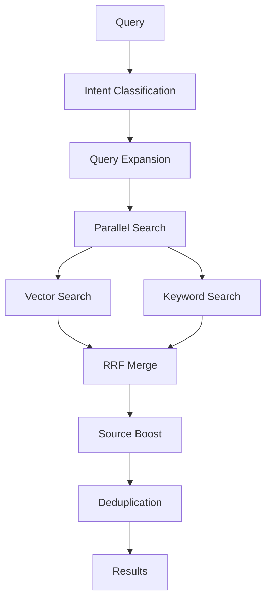

# Search Ranking

GBrain's search combines vector similarity, keyword BM25, and graph boosting into a unified ranking system.

## Search Pipeline



## Intent Classification

Queries are classified into types that affect ranking:

| Intent | Detail Level | Behavior |
|--------|-------------|----------|
| **Entity** | Auto | Normal ranking, graph boost |
| **Temporal** | High | Recent content surfaced |
| **Event** | High | Time-sensitive results |
| **General** | Medium | Balanced ranking |

## Hybrid Search

### Vector Search

- Embeds query using OpenAI text-embedding-3-large
- Searches pgvector index for similarity
- Scales with `ORDER BY embedding <=> $1`

### Keyword Search

- BM25 ranking via Postgres full-text search
- Trigram matching for fuzzy queries
- `ts_rank` for relevance scoring

### Reciprocal Rank Fusion (RRF)

Results from vector and keyword search are merged using RRF:

```
score = Σ (1 / (k + rank))  where k=60
```

## Source-Aware Ranking

Curated content outranks bulk/processing content:

| Source Type | Boost Factor |
|-------------|-------------|
| `originals/` | 1.5 |
| `writing/` | 1.4 |
| `concepts/` | 1.3 |
| `people/`, `companies/`, `deals/` | 1.2 |
| `daily/` | 0.8 |
| `media/x/` | 0.7 |
| `wintermute/chat/` | 0.5 |

## Hard Excludes

Certain paths are excluded from search by default:

- `test/`
- `archive/`
- `attachments/`
- `.raw/`

Use `include_slug_prefixes` to opt back in.

## Two-Stage CTE Ranking

For vector search, a two-stage CTE preserves HNSW index usage:

```sql
-- Inner: HNSW-aware ordering
WITH vector_results AS (
  SELECT *, embedding <=> $1 AS vector_score
  FROM content_chunks
  WHERE embedding IS NOT NULL
  ORDER BY embedding <=> $1
  LIMIT 100
)
-- Outer: Source-boost re-ranking
SELECT *, vector_score * source_factor AS final_score
FROM vector_results
ORDER BY final_score DESC
```

## Dedup Key

Duplicate pages are collapsed using:
- Best score from each source
- Slug-based deduplication

## See Also

- {doc}`../commands/query` - Query command
- {doc}`../architecture/search-layer` - Search architecture
- {doc}`../concepts/knowledge-graph` - Graph boost