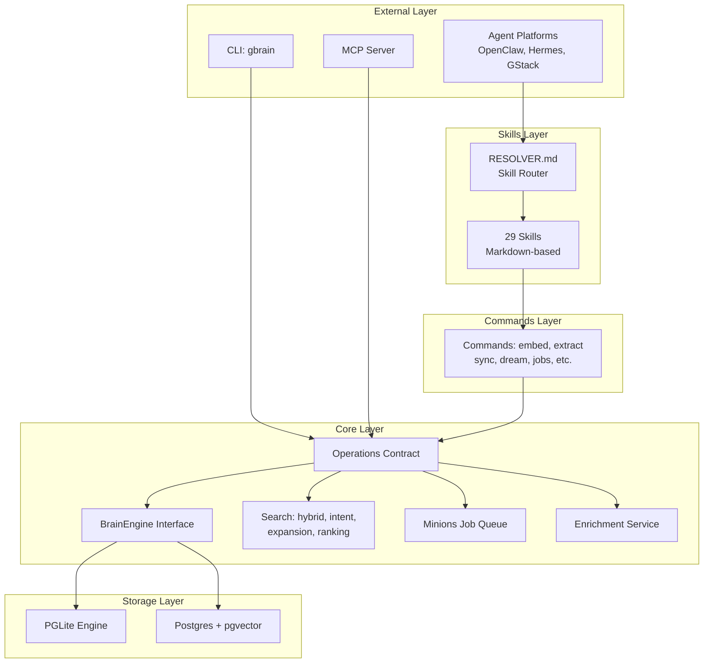
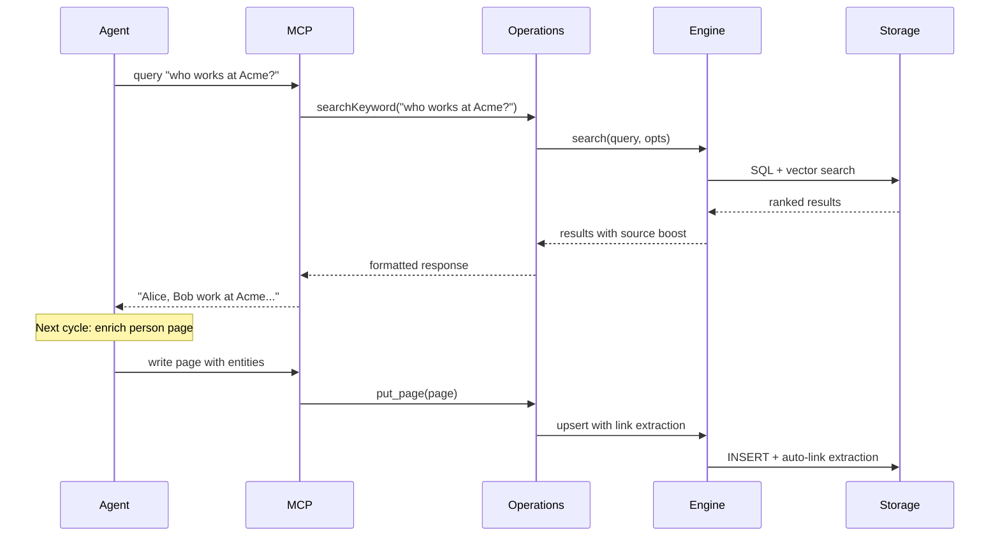

# GBrain Architecture

## System Overview

GBrain is organized around a contract-first design where `src/core/operations.ts` defines ~41 shared operations. Both the CLI and MCP server are generated from this single source of truth.

## Trust Boundary

GBrain distinguishes between trusted and untrusted callers:

| Context | `remote` flag | Access |
|---------|---------------|--------|
| **Local CLI** | `remote: false` | Full access via `src/cli.ts` |
| **MCP Agents** | `remote: true` | Restricted via `src/mcp/server.ts` |

Security-sensitive operations like `file_upload` tighten filesystem confinement when `remote: true`.

## Key Modules

### Operations Contract (`src/core/operations.ts`)

The foundation of GBrain's architecture. Defines ~41 shared operations that both CLI and MCP consume.

### Engine Interface (`src/core/engine.ts`)

Pluggable engine interface (`BrainEngine`) with two implementations:
- `PGLite Engine`: Embedded Postgres 17.5 via WASM
- `Postgres Engine`: Supabase or self-hosted Postgres + pgvector

### Skills System

Fat markdown files (tool-agnostic, work with both CLI and plugin contexts):
- `skills/RESOLVER.md`: Routes intents to skills
- `skills/*/SKILL.md`: Individual skill implementations
- `skills/_brain-filing-rules.md`: Cross-cutting filing rules

### Minions Job Queue

BullMQ-inspired, Postgres-native job queue:
- Queue, worker, backoff, types
- Protected names, quiet hours, stagger
- Parent-child DAGs with depth/cap/timeouts

## Data Flow

## Storage Engines

### PGLite Engine

- Embedded Postgres 17.5 via WASM
- Zero-config, ready in 2 seconds
- Default for local/development use
- Supports up to ~1000 files

### Postgres Engine

- Full Postgres + pgvector
- Supports multi-machine sync
- Recommended for 1000+ files
- Supabase or self-hosted

## Search Architecture

GBrain's search pipeline:

1. **Intent Classification**: Entity/temporal/event/general
2. **Query Expansion**: Multi-query via Haiku
3. **Hybrid Search**: Vector + keyword + RRF
4. **Source-Aware Ranking**: Curated content outranks bulk
5. **Dedup**: Collapses duplicate pages

## See Also

- {doc}`../concepts/engines` - Engine details
- {doc}`../concepts/operations` - Operations reference
- {doc}`../concepts/knowledge-graph` - Knowledge graph layer