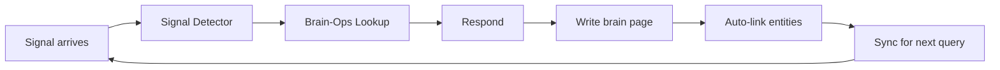

# Introduction to GBrain

**GBrain** is a personal knowledge brain and GStack mod for AI agent platforms. It gives your AI agent a searchable, self-wiring knowledge graph that compounds over time.

## What GBrain Does

Your AI agent is smart but forgetful. GBrain gives it a brain.

- **Ingests** meetings, emails, tweets, voice calls, articles, and original ideas
- **Enriches** every person and company encountered with web + social data
- **Links** knowledge automatically with typed relationships (zero LLM calls)
- **Searches** with hybrid vector + keyword + graph-boosted ranking
- **Self-repairs** citations, consolidates memory, and fixes its own errors overnight

## The Core Loop



Every cycle adds knowledge. The agent enriches a person page after a meeting. Next time that person comes up, the agent already has context.

## Key Features

### 29 Built-in Skills

GBrain ships 29 skills covering:
- **Always-on**: signal-detector, brain-ops
- **Content ingestion**: ingest, idea-ingest, media-ingest, meeting-ingestion
- **Brain operations**: enrich, query, maintain, citation-fixer, repo-architecture, publish, data-research
- **Operational**: daily-task-manager, daily-task-prep, cron-scheduler, reports, cross-modal-review, webhook-transforms, testing, skill-creator, skillify, skillpack-check, smoke-test, minion-orchestrator
- **Identity & setup**: soul-audit, setup, migrate, briefing
- **Conventions**: cross-cutting rules for quality, brain-first lookup, model routing

### Pluggable Engines

GBrain supports two storage engines:

| Engine | Use Case | Setup |
|--------|----------|-------|
| **PGLite** | Default, zero-config | Embedded Postgres 17.5 via WASM, ready in 2 seconds |
| **Postgres** | 1000+ files, multi-machine | Supabase or self-hosted Postgres + pgvector |

### Self-Wiring Knowledge Graph

Every page write extracts entity references and creates typed links:
- `attended`, `works_at`, `invested_in`, `founded`, `advises`, `source`, `mentions`

### Hybrid Search

GBrain's search combines:
- **Vector similarity** for semantic matching
- **Keyword BM25** for exact term matching
- **Graph boost** from backlink density
- **Source-aware ranking** (originals/ outrank chat logs)
- **Reciprocal Rank Fusion (RRF)** for result merging

## Architecture Principles

```{mermaid}
graph TB
    subgraph CLI
        A[gbrain CLI]
    end
    subgraph MCP
        B[MCP Server]
    end
    subgraph Skills
        C[29 Skills<br/>Markdown-based]
    end
    subgraph Engine
        D[BrainEngine Interface]
        E[PGLite Engine]
        F[Postgres Engine]
    end
    A --> D
    B --> D
    C --> D
    D --> E
    D --> F
```

- **Contract-first**: `src/core/operations.ts` defines ~41 shared operations
- **Thin harness, fat skills**: intelligence lives in the skills, not the runtime
- **Engine-agnostic**: CLI and MCP server work with both PGLite and Postgres