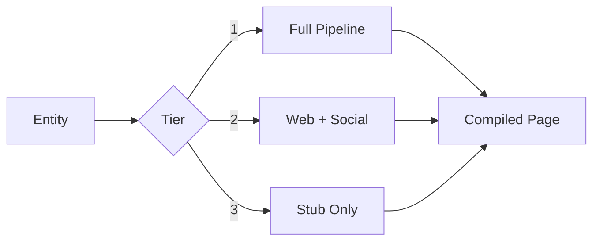

# Enrich

Tiered entity enrichment for people and companies.

## Purpose

Creates and maintains rich people and company pages with web + social data, compiled truth, and timelines.

## Enrichment Tiers

### Tier 1: Full Pipeline
Trigger: Meeting or 8+ mentions across sources
- Web search (name, bio, role)
- Social profiles (LinkedIn, Twitter, etc.)
- Company info (funding, team, news)
- Timeline compilation
- Relationship mapping

### Tier 2: Web + Social
Trigger: 3+ mentions across different sources
- Web search (name, role, company)
- Basic social profiles
- Company association

### Tier 3: Stub Only
Trigger: 1 mention
- Create basic page
- Note source of mention
- No external lookup

## Preconditions

- Entity identified (person or company)
- Tier determined by mention count/source

## Enrichment Process

## Auto-Escalation

Enrichment auto-escalates:
- Tier 3 → Tier 2: After 3 mentions across sources
- Tier 2 → Tier 1: After meeting or 8+ mentions

## Compiled Truth

For Tier 1/2, maintain compiled truth:
- Most recent information wins
- Contradictions noted with sources
- Confidence scores based on source quality

## See Also

- {doc}`../skills/meeting-ingestion` - Meeting-triggered enrichment
- {doc}`../skills/signal-detector` - Mention tracking
- {doc}`../concepts/knowledge-graph` - Entity linking