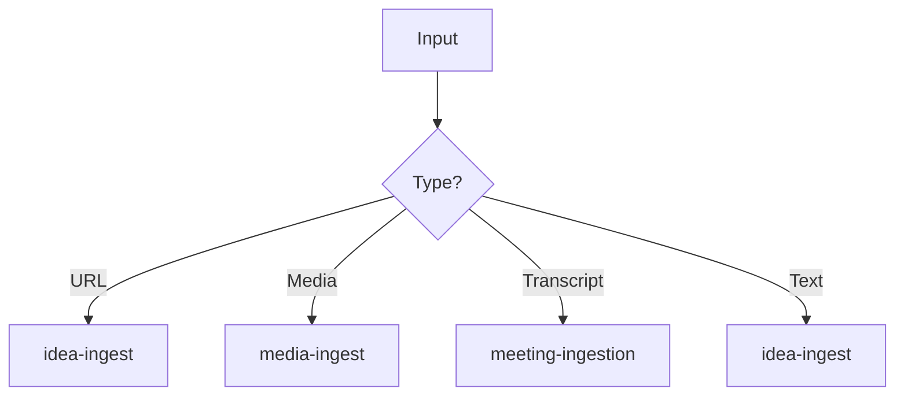

# Ingest

**Router** skill for content ingestion.

## Purpose

Detects input type and delegates to the appropriate ingestion skill.

## Input Types

| Type | Delegation |
|------|------------|
| URL / Link | → idea-ingest |
| Tweet / Social | → idea-ingest |
| Video / Audio | → media-ingest |
| PDF / Document | → media-ingest |
| Meeting Transcript | → meeting-ingestion |
| Article Text | → idea-ingest |

## Preconditions

- Input content available
- Content type identified

## Decision Flow

## Steps

1. **Detect** — Identify content type
2. **Validate** — Ensure content is parseable
3. **Delegate** — Route to appropriate skill
4. **Track** — Log ingestion in brain

## Quality Gates

- Content successfully parsed
- Entity extraction complete
- Links resolved

## See Also

- {doc}`../skills/idea-ingest` - Article/link ingestion
- {doc}`../skills/media-ingest` - Media ingestion
- {doc}`../skills/meeting-ingestion` - Meeting ingestion